# Model

Link naar de site: url="https://punkyfis.nl"

# Knowledge base

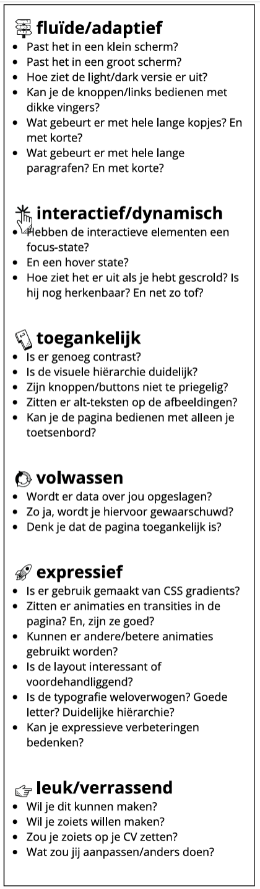

# Learning Log

## 31 aug - Kickoff

Een fork van de model repository gemaakt en gepubliceerd via mijn eigen Github omgeving.
Ik heb besloten toch bij VSCode te blijven omdat ik dit al in heb gesteld zoals ik wil, ik gebruik ook Github dus ik word toch al getrackt.

1. Leg uit wat een source hosting platform is en voor welke jij gekozen hebt.<br>
   Een source hosting platform is een online plek om je commits bij te houden. Ik heb voor GitHub gekozen omdat ik eerder ICT heb gedaan en we daar met GitLab moesten werken
2. Vertel welke domeinnaam jij gekozen hebt en hoe je die hebt gekoppeld aan jouw pagina.<br>
   Ik heb punkyfis.nl gekozen en deze heb ik gekoppeld met de instructies op DLO, het is nog niet helemaal gelukt maar dat komt omdat ik de nieuwe DNS nog moet laten laden. Het kan 24 uur duren zeggen ze.
3. Beschrijf hoe je aanpassingen aan jouw pagina kunt maken en hoe je er voor zorgt dat die op het web gepubliceerd worden.<br>
   Ik kan dingen aanpassen in de HTML en CSS -later misschien typescript- en dat word gepubliceerd door de nieuwe code te committen via github.

## 02 sep - Deep Dives

### Typografie

Helaas was ik door een een zware ochtend met veel onvoorspelde gebeurtenissen een uur te laat. Hierdoor heb ik het grootste deel van de les gemist.
typography.com

Voor de opdracht moesten we fonts zoeken die bij Dolly Parton passen (naar onze mening, gebasseerd op de woorden op het bord). We moesten eerst een web maken maar daar was ik niet bij. De volgende fonts heb ik gekozen, ik vind ze passen bij western en glam.
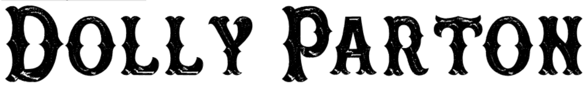
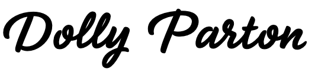

### CSS: fonts met kleur en effecten

#### Opdracht 1

```
@font-face {
    font-family: "Ex";
    src: url(../fonts/ExpletusSans-Regular.ttf);
    font-weight: 400;
}

@font-face {
    font-family: "Ex-bold";
    src: url(../fonts/ExpletusSans-Bold.ttf);
    font-weight: 700;
}

main {
    font-family: "ex", sans-serif;

}

main p {
    /* jouw code hier */
    line-height: normal;

}

main p::first-letter {
    /* jouw code hier */
    font-size: large;
    font-weight: 700;
    color: #f09;
}
```

#### Opdracht 2

```
/*******************************/
/* CODE VOOR HET EERSTE BLOKJE */
/*******************************/

/* hiermee selecteer je de eerste li */
li:nth-of-type(1) {
    /* h2 in het midden van de li */
    /* hoef je nu nog niet te snappen - mag wel ;-) */
    display: grid;
    place-items: center;
    /* jouw code hier */
    background-color: rgb(0 24 54);
}

/* hiermee selecteer je de h2 in de eerste li */
li:nth-of-type(1) h2 {
    /* de h2 wordt zo smal als het langste woord */
    /* daardoor staat elk woord op een nieuwe regel */
    width: min-content;
    /* en dan gecentreerd */
    text-align: center;

    /* jouw code hier */
    font-family: "Montserrat", sans-serif;
    font-size: 1.5rem;
    font-weight: 100;
    color: white;
    line-height: 1.5;
    text-transform: uppercase;
    text-shadow: 0 0 20px cyan;
}


/*******************************/
/* CODE VOOR HET TWEEDE BLOKJE */
/*******************************/

li:nth-of-type(2) {
    /* h2 in het midden van de li */
    display: grid;
    place-items: center;
    /* jouw code hier */
    background-color: rgb(230 127 138);

    li:nth-of-type(2) h2 {
    width: min-content;
    text-align: center;

    /* jouw code hier */
    font-family: "Saira", sans-serif;
    font-size: 2.5rem;
    font-weight: 700;
    line-height: 1.5;
    letter-spacing: 0.1em;
    text-transform: uppercase;
    text-align: center;
    text-shadow: 5px 5px 0px rgb(0 0 0 / .5);
    color: white;
    transform: skewY(-10deg);

}
}


```

#### Opdracht 3 + 4


CSS - A2 met animatie

```
li:nth-of-type(1) {
    /* rotate: 2deg; */

  display:grid;
  place-items:center;
	
	h2 {
	  margin:0;
	  
	  font-family:'archivo';
	  font-size:8em;
	}
	
	h2 span {
	  display:inline-block;
		mix-blend-mode:multiply;

		&:first-child {
		  translate:.18em 0em; /* eerst x-as dan y-as */
		  color:rgb(0, 142, 170);
		}
		
		&:last-child {
		  translate:-.18em 0em;
		  color:rgb(252, 168, 168);
		}

		transition:.5s;

		li:hover & {
			&:first-child {
				color:rgb(252, 168, 168);
			}
			
			&:last-child {
				color:rgb(0, 142, 170);
			}
		}
	} 
}
```

CSS - Myst met animatie

```
li:nth-of-type(2) {
  display:grid;
  place-items:center;
  
  background-color:rgb(60% 60% 60%);
	
	h2 {
	  font-family:'black han', sans-serif; 
	  font-size:4em;
	  text-shadow:5px 5px 5px rgb(0 0 0 / .5);
		text-transform:uppercase;
		line-height:1em;
	  color:rgb(60% 60% 60%);

		transition:.5s;

		li:hover & {
			text-shadow:0 0 0 rgb(0 0 0 / .5);
			color:rgb(40% 40% 40%);
		}
	}
}
```

CSS - CMYK met animatie

```
li:nth-of-type(3) {
      display:grid;
  place-items:center;
  
  background-color:rebeccapurple;

	overflow:clip;

	h2 {
	    font-family:"aldrich", sans-serif;
	    font-size:4em;
	    color:white;
	    text-shadow:
	        -.05em -.05em 0 cyan,
	        .05em -.05em 0 magenta,
	        .05em .05em 0  yellow,
	        -.05em .05em 0 black;
		text-box:trim-both cap alphabetic;
		transition:1s;
		li:hover & {
			text-shadow:
	        0em -2em 0 cyan,
	        0em -1em 0 magenta,
	        0em 1em 0  yellow,
	        0em 2em 0 black;
		}
	}
}
```

Dit was de moeilijkste, voor deze was ik in inspect gegaan om te kijken dus hij telt neit helemaal! Ik wist niet dat die schaduwen zo werkte, uit de opdracht kon ik niet opmaken dat het schaduwen waren. Al is deze code dus niet door mij bedacht heb ik het onderzocht hoe deze werkt en er veel van geleerd.

Uitendelijk waren deze drie me gelukt met animatie (behalve de derde officieel, maar nu kan ik het). Om eerlijk te zijn wist ik niet waar ik moest beginnen, ik wist niet uit wat voor elementen het bestond. Wel heb ik veel nieuwe dingen geleerd, ik wist niet van nth\_of\_type() en dat je dingen zoals h2 daarin weer kan stoppen.

## 03 sep - Thuiswerk

Vandaag heb ik meer pagina's toegevoegd, ze stonden al in de html maar niet in het mapje, ook heb ik de Github pagina gelinkt.
Ik heb de navbar veranderd, het is voor nu een simpele niet opgemaakte band boven. Dit is om gewoon makkelijk tussen de verschillende pagina's te gaan. Later wil ik sowieso op de index een mooiere manier maken.

CSS tijdelijke navbar:

```
.navbar ul {
    list-style-type: none;
    margin: 0;
    padding: 0;
    overflow: hidden;
}

.navbar a {
    text-decoration: none;
    margin: 0;
    padding: 15px;
    display: block;
    text-align: center;
    color: white;
}

.navbar a:hover {
    background-color: rgba(0, 0, 0, 0.5);
}

.navbar li {
    float: right;
}
```

Ook heb ik aangepast hoe de CSS werkt. Ik heb één CSS waarin de algemene dingen komen, hierin staan de lettertypes, de opmaak van de bovenste balk en alle dingen die voor alle pagina's tellen. Daarnaast heb ik elke HTML een eigen CSS gegeven zodat ik gedetailleerd elke pagina op zichzelf kan bewerken.

## 04 sep - Deep Dives                ^-^

### Praktische CSS

Veel wat besproken wist ik al door mijn eerdere studie (1 jaar HBO-ICT) en jaar 1 blok 1. Desalniettemin heb ik veel geleerd van deze deep dive.

Het belangrijkste zijn variabelen, hier ben ik nooit eerder zo erg op in gegaan. We hebben ook een handige site gekregen om de variabelen makkelijk te maken, (https://utopia.fyi/type/calculator/?c=360,16,1.067,1440,18,1.414,5,2,\&s=0.75%7C0.5%7C0.25,1.5%7C2%7C3%7C4%7C6,s-l\&g=s,l,xl,12). Hieronder staat mijn code en andere nieuwe dingen die ik heb geleerd (de onbelangrijke dingen staan niet in de snippet hieronder, dit is niet de hele CSS)

```
html {
    --whitespace: 2em;
    --whitespace-calc: calc(var(--whitespace) / 2);
    --step--2: clamp(0.4297rem, 0.7827rem + -0.3922cqi, 0.6944rem);
    --step--1: clamp(0.6953rem, 0.8793rem + -0.2045cqi, 0.8333rem);
    --step-0: clamp(1rem, 0.9583rem + 0.1852cqi, 1.125rem);
    --step-1: clamp(1.2rem, 0.9933rem + 0.9189cqi, 1.8203rem);
    --step-2: clamp(1.44rem, 0.9383rem + 2.2299cqi, 2.9452rem);
    --step-3: clamp(1.728rem, 0.7156rem + 4.4997cqi, 4.7653rem);
    --step-4: clamp(2.0736rem, 0.1947rem + 8.3505cqi, 7.7102rem);
    --step-5: clamp(2.4883rem, -0.8406rem + 14.7953cqi, 12.4751rem);
}

html {
    --factor: 1.4;
}

h1 {
    font-size: var(--step-2);
}

h2 {
    font-size: var(--step-1);
    text-wrap: balance; /* Zorgt dat de tekst netjes wordt, blijft binnen de kolom */
}

h3 {
    font-size: var(--step-0);
}

body {
    margin: var(--whitespace);
}

p {
    margin: var(--whitespace-calc);
}

li {
    margin: var(--whitespace);
}
```

Nog een klein ding wat ik geleerd heb, ik wist niet dat de focus kleur aangepast konden worden!

```
input:focus,
textarea:focus,
button:focus {
    outline: 2px solid rgb(49, 141, 164);
}
```

### Schetsen

# SCHETSEN SCANNEN EN HIER DOEN!!

# Sprint 1

## 07 sep - Sprintplanning            ^-^

Blijkbaar moeten we elke Deep-Dive doen, dit wist ik niet. Deze maak ik later, nu ik dat weet hebben we oppeens zo veel werk!
Mijn vriend heeft water over mijn laptop gegooid dus dat is ook een tijdelijke setback. Ik ben opzoek naar een nieuwe
alleen is dit erg duur. Ik hoop dat de laptop het volhoud tot ik een nieuwe heb.

1. Leg uit wat een digital garden is en waarom dat anders is dan een reguliere website. <br>
   Het is persoonlijk, het gaat over iets waar jij passie voor hebt. Ook plan je het niet van tevoren, het groeit terwijl je
   bezig bent.

2. Leg uit wat een website 'webby' maakt en welke websites jou het meeste inspireren. <br>
   Toegankelijk,

3. Vertel waar jij mee aan de slag wilt gaan bij het maken van jouw eigen digital garden
   let op: dit zijn jouw eerste ideeën, dit kan en mag veranderen in de loop van het programma.<br>

## 11 sep - School en deep dive

We moesten vandaag ons idee vertellen. Ik vertelde oven mijn idee om de site een 3DS te maken en hij vond het een goed idee en vertelde me dat ik moest gaan tekenen, dat had ik nog niet gedaan. In het begin werd verteld dat dit juist niet moest? Desalniettemin ben ik meteen gaan tekenen:
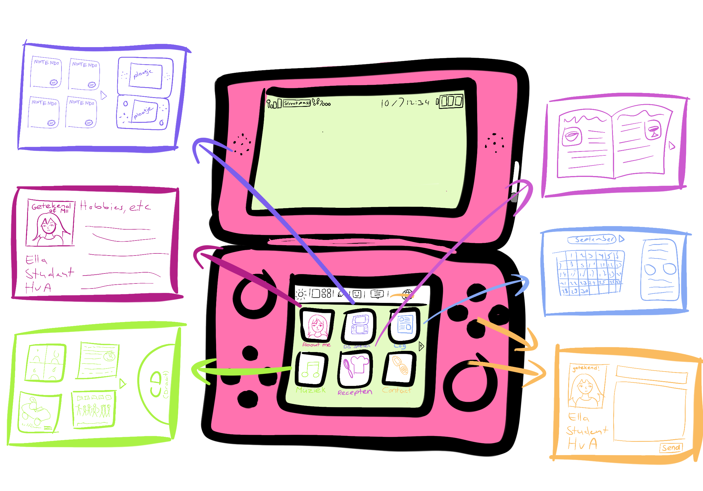

### Grid 101                           ^-^

Deze deepdive bestaat aan 3 opdrachten waarin je leert met grid werken.

#### Opdracht 1

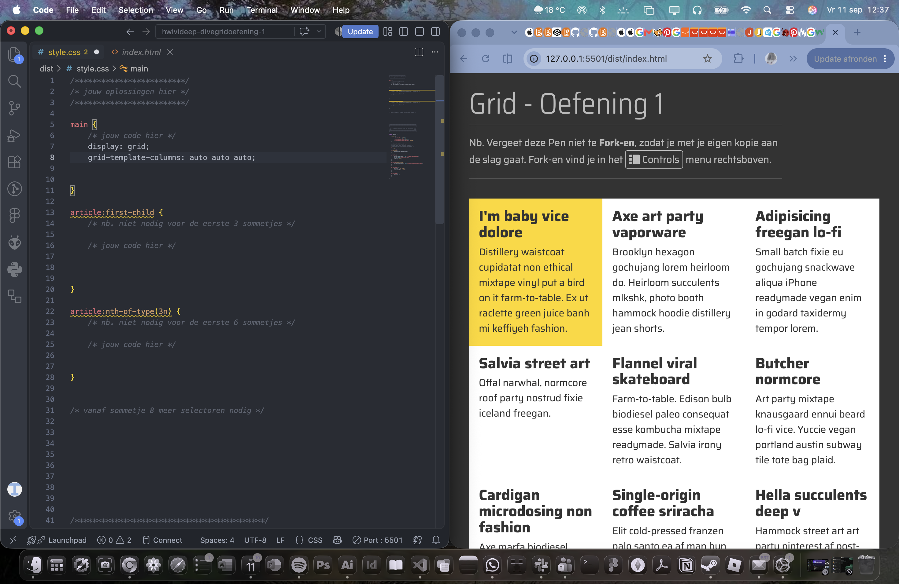
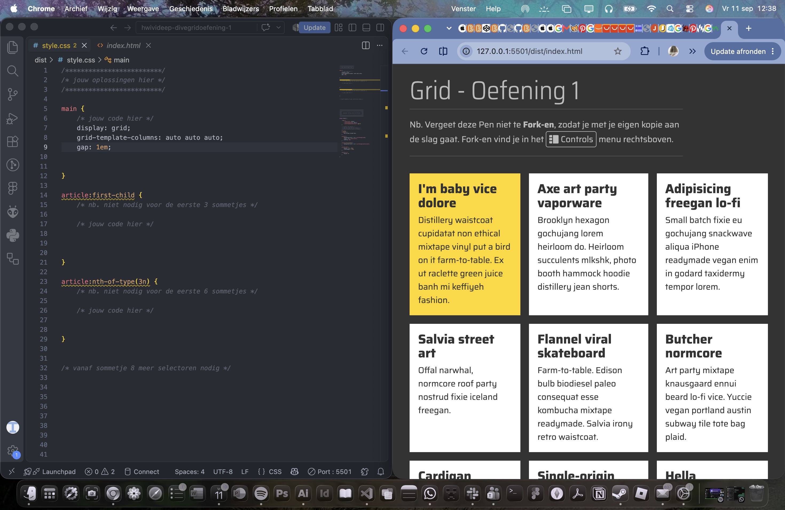
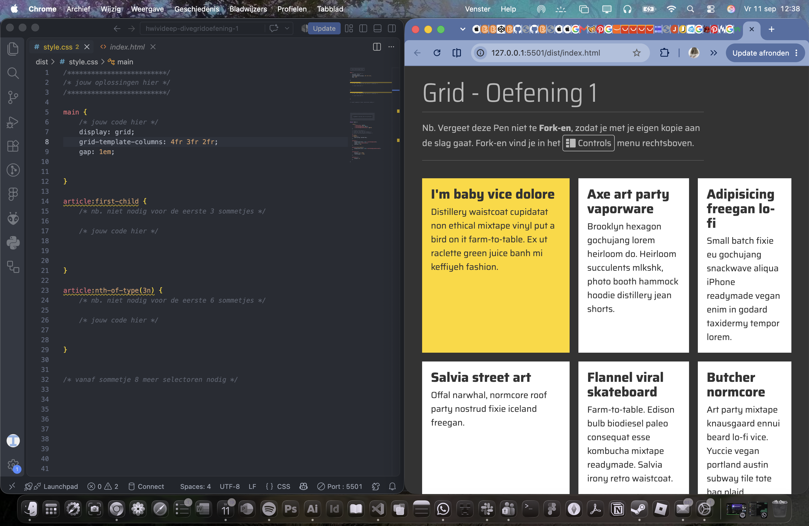
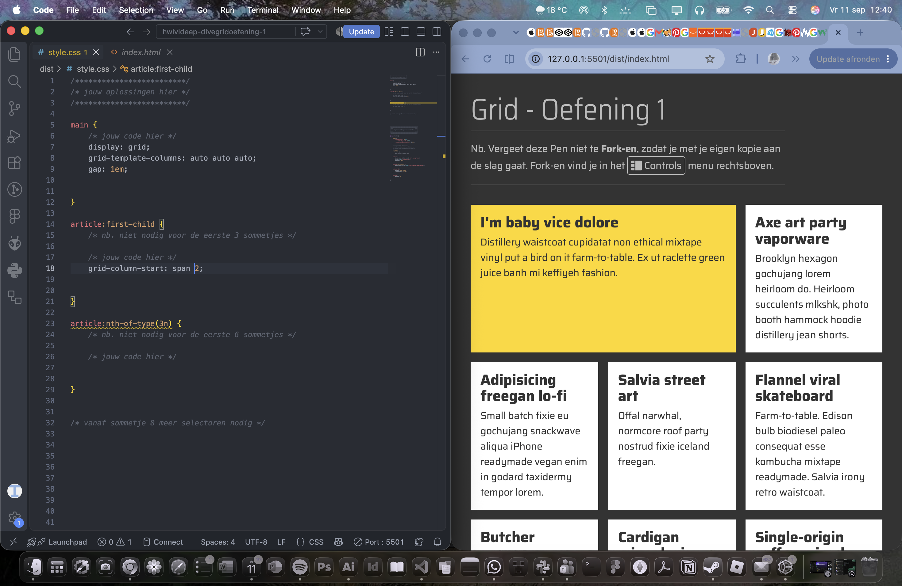
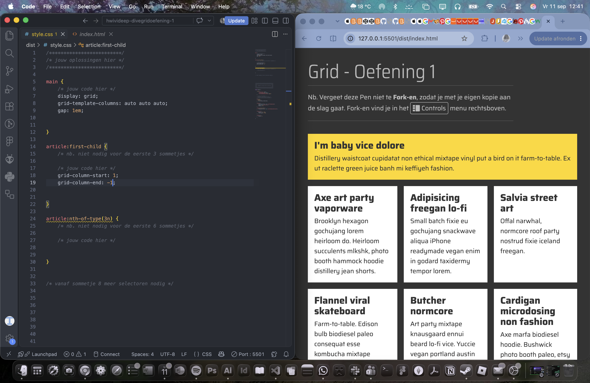
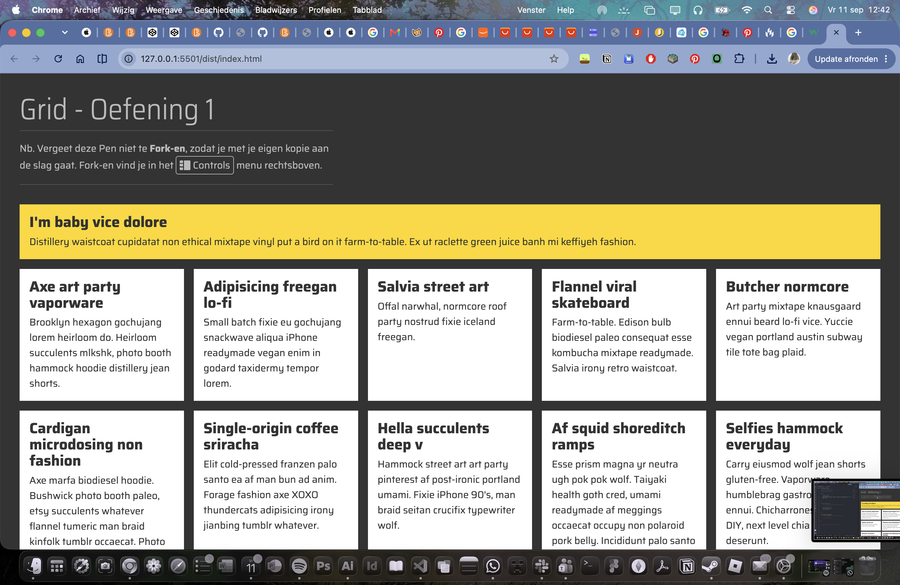
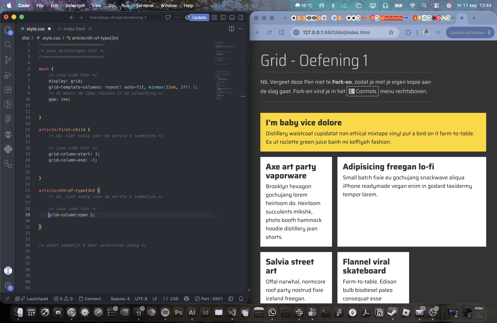
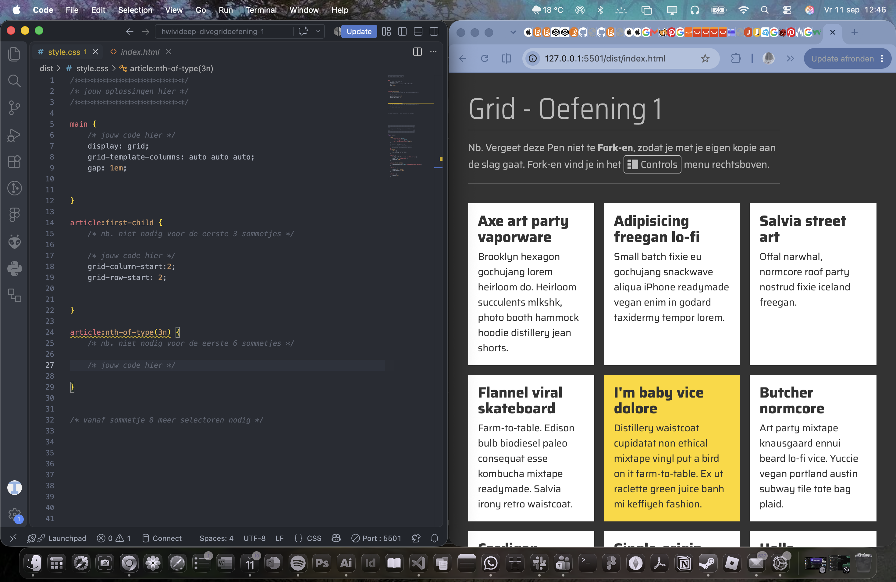
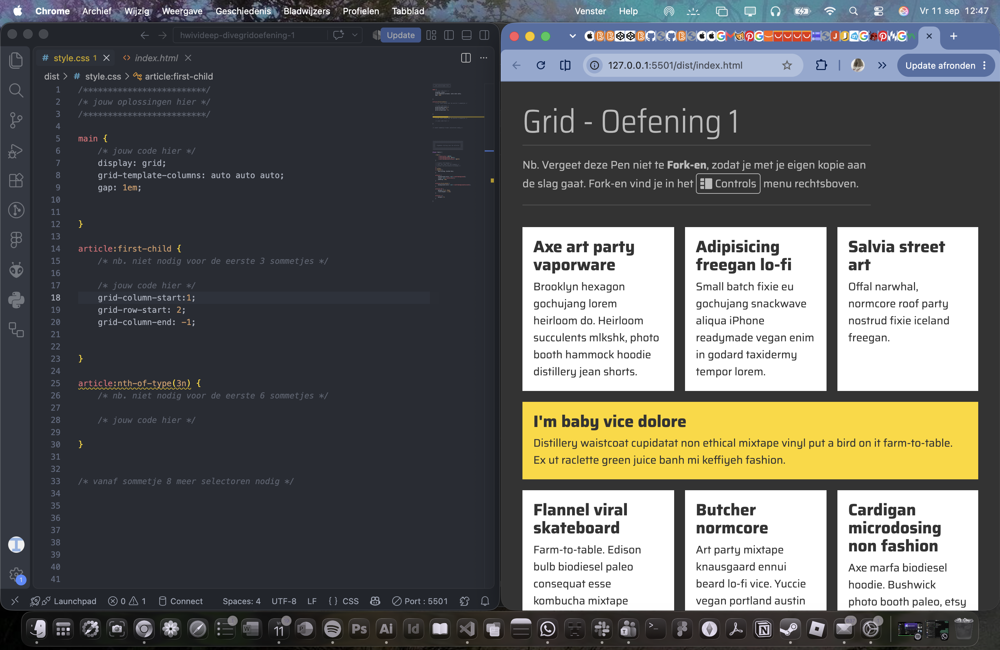
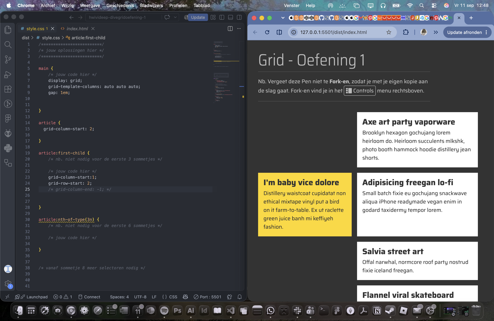

## 13 sep - Thuiswerk

Ik heb een SVG gemaakt van een open 3DS, helaas heb ik niet het goede model kunnen vinden op de manier die ik zelf wou. Ik vond een foto van een blauwe new 3DS XL (ik zocht een roze 3DS XL). In Illustrator heb ik image trace gedaan met 6 kleuren, dit werd de dark mode DS. Ik heb in Illustrator het kleurenpallet aangepast, hierdoor werd de eerst blauwe DS een roze DS, dit werd de light mode versie.

Dit zijn de kleuren van de roze SVG:

```
/* 3DS SVG */
    --cls-1: #d16993;
    --cls-2: #a7446c;
    --cls-3: #883d55;
    --cls-4: #cbc7c6;
    --cls-5: #a75878;
    --cls-6: #7c4f49;
    --cls-7: #ac5d74;
    --cls-8: #fcfff2;
    --cls-9: #fcfff2;
    --cls-10: #c36987;
    --cls-11: #713244;
    --cls-12: #fcfff2;
```

Vervolgens wou ik dat de schermen op de juiste plekken kwamen en bleven. Ik heb 2 divs gemaakt, topScherm en bottomScherm. Toen kwam het deel waar ik bang voor was, hoe krijg ik ze op de goede plek en zorg ik dat ze goed blijven als ik de vorm van het venster verander? Het bleek heel makkelijk te kunnen met de juiste procenten. Omdat ik met em probeerde te werken lukte het niet, maar met procenten is het gelukt.

### Code:

Top scherm

```
#topScherm {
    position: absolute;
    z-index: 0;
    top: 7.5%;
    left: 16.5%;
    width: 67%;
    height: 37.5%;
}
```

Bottom scherm

```
#bottomScherm {
    position: absolute;
    z-index: 0;
    top: 55.3%;
    left: 22.8%;
    width: 54.5%;
    height: 38.7%;
}
```

## 14 sep - Maandag

In de les ben ik verder gegaan met mijn licht/dark mode, ik heb nu 3 opties, auto, light en dark. Dit is niet hoe ik het wil in mijn site, ik wil één knop hebben die het van light naar dark laat gaan. Hiervoor moest ik de hele code herschrijven.

### Oude code Dark/Light mode

HTML

```
		<form>
			<label>
				<input type="radio" name="theme" value="auto-theme" checked> auto
			</label>
			<label>
				<input type="radio" name="theme" value="light-theme"> licht
			</label>
			<label>
				<input type="radio" name="theme" value="dark-theme"> donker
			</label>
		</form>
```

CSS

```
--cls-1: light-dark(#d16993, #587da7);
    --cls-2: light-dark(#a7446c, #587da7);
    --cls-3: light-dark(#883d55, #292841);
    --cls-4: light-dark(#cbc7c6, #cbc7c6);
    --cls-5: light-dark(#a75878, #405171);
    --cls-6: light-dark(#7c4f49, #292841);
    --cls-7: light-dark(#ac5d74, #405171);
    --cls-8: light-dark(#fcfff2, #fcfff2);
    --cls-9: light-dark(#fcfff2, #fcfff2);
    --cls-10: light-dark(#c36987, #587da7);
    --cls-11: light-dark(#713244, #292841);
    --cls-12: light-dark(#fcfff2, #fcfff2);

accent-color:light-dark(black, White); 
} 

de toggles 

html:has([value="light-theme"]:checked) {
    color-scheme: light;
}

html:has([value="dark-theme"]:checked) {
    color-scheme: dark;
} 

```

### Nieuwe code:

HTML

```
<button onclick="lightDark()">O</button>
```

CSS

```
body {
    background: var(--background);


    /* Licht theme */
    --background: rgb(220, 208, 182);
    --liBackground: rgb(255, 195, 209);

    /* 3DS SVG */
    --cls-1: #d16993;
    --cls-2: #a7446c;
    --cls-3: #883d55;
    --cls-4: #cbc7c6;
    --cls-5: #a75878;
    --cls-6: #7c4f49;
    --cls-7: #ac5d74;
    --cls-8: #fcfff2;
    --cls-9: #fcfff2;
    --cls-10: #c36987;
    --cls-11: #713244;
    --cls-12: #fcfff2;


}

.dark-theme {
    --background: rgb(56, 58, 89);
    --liBackground: rgb(41, 40, 65);

    /* 3DS SVG */
    --cls-1: #587da7;
    --cls-2: #587da7;
    --cls-3: #292841;
    --cls-4: #cbc7c6;
    --cls-5: #405171;
    --cls-6: #292841;
    --cls-7: #405171;
    --cls-8: #fcfff2;
    --cls-9: #fcfff2;
    --cls-10: #587da7;
    --cls-11: #292841;
    --cls-12: #fcfff2;

    /* accent-color:#fcfff2; */
}
```

JAVASCRIPT

```
function lightDark() {
   var element = document.body;
   element.classList.toggle("dark-theme");
}
```

Voor beide heb ik de volgende code om de delen van de SVG te kleuren:

```
.cls-1 {
    fill: var(--cls-1);
}

.cls-2 {
    fill: var(--cls-2);
}

.cls-3 {
    fill: var(--cls-3);
}

.cls-4 {
    fill: var(--cls-4);
}

.cls-5 {
    fill: var(--cls-5);
}

.cls-6 {
    fill: var(--cls-6);
}

.cls-7 {
    fill: var(--cls-7);
}

.cls-8 {
    font-family: SinhalaMN-Bold, 'Sinhala MN';
    font-size: 24px;
    font-weight: 700;
}

.cls-8,
.cls-9 {
    fill: var(--cls-8);
}

.cls-10 {
    fill: var(--cls-10);
}

.cls-11 {
    fill: var(--cls-11);
}

.cls-12 {
    fill: var(--cls-12);
}

.cls-13 {
    fill: var(--cls-13);
}

.cls-14 {
    fill: var(--cls-14);
}
```

Het bleef heel lang niet werken, ik heb het aan meerdere mensen gevraagd en niemand snapte wat er mis ging. Uitendelijk bleek het dat mijn .js in de iCloud stond, terwijl de rest dat niet staat. Ik weet niet hoe dat is gebeurd maar het is nu opgelost en de light/dark mode toggle werkt. Het kijkt nu niet automatisch naar de systeeminstellingen, dus dat moet ik nog fixen.

### Opdracht 16

1. Maak opnieuw duo's
2. Bekijk elkaars website door de browser groter en kleiner te maken
3. Wanneer is er een verandering van vormgeving/layout nodig? Waarom? Wat is er 'lelijk' of kan beter?
4. Bespreek deze punten met elkaar en maak notities.

Ik was een duo met Feyza, ik heb haar feedback gegeven op haar site
Feedback van Feyza: Layout is goed, misschien de letters iets groter maken voor als het scherm kleiner word, nu kan het moeilijk leesbaar zijn.

Ik moet kijken wat ik moet doen, nu staat er alleen één test zin, maar ik wil dat je niet scrollt op de site, het moet lijken op een DS. Hier heb ik rekening mee gehouden met mijn plan, alles is redelijk groot uitgepland.

### Opdracht 17

1. Maak opnieuw duo’s
2. Zoek samen naar minstens drie interessante voorbeelden van responsive design (tip: kijk eens op Awwwards.com).
3. Laat de voorbeelden aan een ander duo zien en bespreek wat je er interessant aan vindt.
4. Kies gezamenlijk 1 voorbeeld uit dat jullie aan de hele klas willen laten zien

Niemand in de les was hier nog aan toe, daarom doe ik het in mijn eentje.

#### 3 interessante websites

1. https://crency.agency/ - Website makers
2. https://aptransit.co/ - Metro netwerk in New York (staat)
3. https://www.crechetank.com/ - Creative Tech/Media studio

We moesten niet bespreken of iets laten zien, maar als had ik de 3e site laten zien! Creche is zo'n leuke site!! Als ik beter kon programmeren was dit hoe ik mijn site zou maken (dat is niet waar ik had nogsteeds een 3DS gemaakt maar dan mooier). Ik vond het een hele leuke site, heel schattig en visueel aantrekkelijk.

### Check out (met Joëlle)

1. Leg uit wanneer een website 'lelijk' wordt en geef voorbeelden wat je kan doen om deze 'lelijke' onderdelen te fixen?<br>

* Plaatjes te groot - in CSS de img een ander formaat geven
* Geen CSS - CSS bestand toevoegen
* Te weinig whitespace - gaps en breaks toevoegen (padding en margin ook maar dat mag niet in dit project)

3. Vertel welke volgende stap je neemt om je website responsive te maken.<br>

* Grid
* Geen px gebruiken maar dingen zoals em en %
* @media gebruiken

3. Kun je het ontwerp en de bouw van je eigen Garden (zo uit je hoofd) onderbouwen in Webby vocabulair? <br>
   Op dit moment is het nog niet heel webby, mijn website is op dit moment heel responsive. Voordat ik iets afrond zorg ik eerst dat het op alle formaten scherm werkt. Al mis ik op het moment nog veel is mijn website wel (onderweg naar) expressief. Het is nog niet af, ik heb nog geen font gekozen en nu ik erover denk ook geen text op de site. En hoe ik het bekijk zou ik dit niet alleen op mijn CV willen zetten, ik zit er ook aan te denken om dit (als het mooier is) als mijn portfolio template willen gebruiken.

## 15 sep - Thuiswerk

https://mii.nxw.pw/app
Ik heb deze site gebruikt om een MII te maken van mezelf om deze te kunnen gebruiken voor de site. Ik heb deze gemaakt zoals mijn oude DS poppetje.

Deze ga ik gebruiken op de site, ik heb png's in allemaal verschillende poses die ik door de site heen ga gebruiken.

Ook ben ik begonnen met de indeling van het onderste scherm, ik heb in totaal 6 pagina's. Verder bestaat het onderste scherm uit een balk met 6 knoppen erin

```
<!-- Bottom scherm-->
<div id="bottomScherm">
    <span id="bar">
        <button onclick="lightDark()">O</button> <!-- light/dark toggle-->
        <button>o[]</button> <!-- groot/klein-->
        <button>✎</button> <!-- potlood -->
        <button>:]</button> <!-- smiley -->
        <button>☰</button> <!-- textwolk -->
        <button>www</button> <!-- internet wereldbol -->
    </span>
    <ul id="menu">
        <!-- <li><a href="https://github.com/EllavanWilligen/punkyfis">-GitHub-</a></li> -->
        <li><a href="about.html">-About-</a></li>
        <li><a href="spellen.html">-Spellen-</a></li>                        
        <li><a href="log.html">-Log-</a></li>  <!-- Link naar Github of log, wat is link naar log pagina? https://punkyfis.nl/README.md is niet mooi, eerst had ik het perongeluk mooi? -->
        <li><a href="muziek.html">-Muziek-</a></li>
        <li><a href="recepten.html">-Recepten-</a></li>
        <li><a href="contact.html">-Contact-</a></li>
    </ul>
</div>
```

Nog maar 1 button werkt, dat is de light/dark toggle, van "internet wereldbol" wil ik de random link maken die onderaan de site staat, maar ik kan de code hiervoor niet vinden.

Om te testen of alles werkte heb ik eerst elke li een andere kleur gegeven:
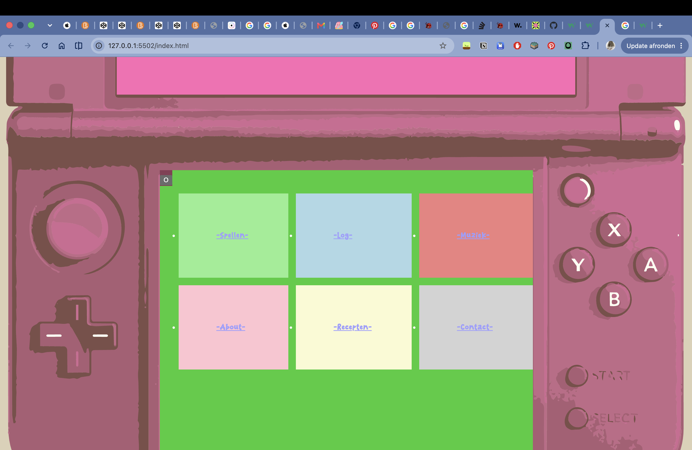
Dit werkte allemaal prima dus ik kon verder met de individuele opmaak van elke li

De li van ul id="menu" worden vormgegeven met de juiste CSS selectoren. Hierdoor kan ik ze later allemaal individueel vormgeven, al hebben ze nu tijdelijk hetzelfde uiterlijk allemaal. Als later blijkt dat ik de achtergrond wel overal dezelfde kleur doe maak ik dit netter en zet ik de line gewoon in #menu li.

```
#menu li {
    min-width: 0;
    aspect-ratio: 1 / 1;
    max-width: 100%;
    max-height: 100%;
    box-sizing: border-box;
    display: grid;
    place-items: center;
    padding: clamp(0.15em, 1vw, 0.4em);
    background: linear-gradient(145deg, #ffffff, #e9edeb);
    border: 1px solid #aeb8b7;
    border-radius: 1.5em;
    box-shadow: 2px 3px 4px rgb(53 63 65 / 35%), inset 1px 1px #ffffff;
}

#menu li:nth-of-type(1) {
    background: linear-gradient(145deg, #e2e2e2, #b0b0b0);
}

#menu li:nth-of-type(2) {
    background: linear-gradient(145deg, #e2e2e2, #b0b0b0);
}

#menu li:nth-of-type(3) {
    background: linear-gradient(145deg, #e2e2e2, #b0b0b0);
}

#menu li:nth-of-type(4) {
    background: linear-gradient(145deg, #e2e2e2, #b0b0b0);
}

#menu li:nth-of-type(5) {
    background: linear-gradient(145deg, #e2e2e2, #b0b0b0);
}

#menu li:nth-of-type(6) {
    background: linear-gradient(145deg, #e2e2e2, #b0b0b0);
}
```

Dit ziet er als volgt uit:\
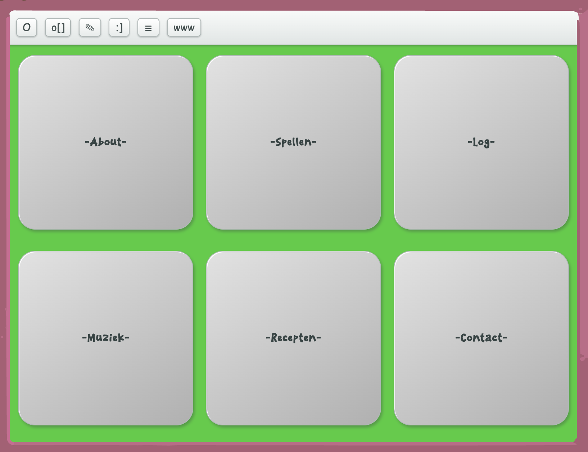

Het volgende wat ik moest doen is een foto toevoegen, uiteindelijk moeten ze allemaal een plaatje hebben. Voor het plaatje van 'About' wil ik de MII die ik heb gemaakt. Hiervoor gebruik ik de volgende code

```
#menu li:nth-of-type(1) {
    background-image: url(../fotos/MIIAbout.png);
    background-size: cover;
}
```

Ik heb de text van de knoppen gehaald, ook heb ik de achtergrond tijdelijk grijs gemaakt. Later wil ik de achtergrond misschien roze of oranje maken maar voor nu hou ik het even neutraal. Nu ziet het er zo uit:
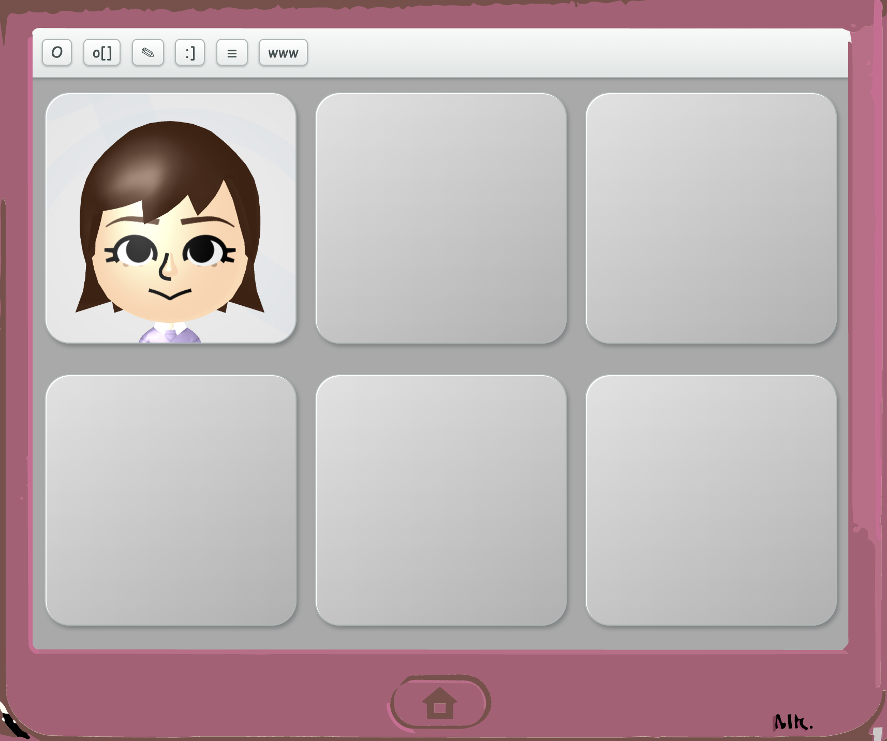

Tot slot heb ik ervoor gezorgd dat de home knop op je DS je naar home stuurt, uiteindelijk wil ik dat de site bestuurbaar is met de DS en alle knoppen van de DS ook echt werken. Maar voor nu is dat heel lastig, veel lastiger dan ik dacht dat het ging zijn.

Vandaag heb ik ook mijn README aangevuld, ik ben nog niet helemaal klaar want die foto's zijn zo veel werk om erin te zetten! Maar verder ben ik klaar!

## 16 sep - Woensdag les

Onderaan had ik de webring en de random link staan. Ik kon deze nergens vinden in de code. In de les heb ik hulp gevraag van de studentmentor (?), hij kwam erachter dat de lege footer de reden was dat de webring er stond. Hij begreep ook niet hoe, we hebben de link uit inspect gehaald en die in mijn site gezet, maar deze leidde alleen naar 1 dezelfde site. Daarom heb ik nu tijdelijk de https://digitaaltuintje.nl erin gezet. Zo is het niet random maar kan je wel naar alle andere tuintjes. Om de "Random" link er weer in te zetten moet ik alleen een footer in de HTMl zetten. Later wil ik wel de "Random" terug maar op de 🌐 in de bar (waar nu https://digitaaltuintje.nl staat)

Verder heb ik de CSS gefixt, #topScherm staat nu in de indivuele CSS files in plaats van in normal.CSS waar alle code staat die op elke site hetzelfde is.

### Check out

1. Noem 3 Gestaltprincipes op en laat de ander uitleggen wat ze betekenen en doen.<br>
   Nabijheid - Dingen die bij elkaar staan worden vaak gezien als één groep
   Sluiting - Mensen vullen automatisch een vorm aan, dus als er alleen delen van staan zien menssen nogsteeds de hele vorm erin
   Gelijkheid - Vormen die op elkaar lijken worden vaak gezien als één groep
2. Een grid biedt ruimte om te spelen (vrijheid), maar tegelijkertijd ook eenheid en structuur (vastigheid). Wat wordt hiermee bedoeld? <br>
   Een grid maakt de site in kolommen, zo plan je het uit en word het een eenheid en structuur, maar wat je in welke kolommen zet en wat je leeg houd geeft je de ruimte om te spelen, de kolommen hoeven ook niet allemaal even groot en dezelfde vorm te zijn.
3. Welk principe neem je mee in een laatste iteratie van je ontwerp? <br>
   Allemaal? Alle principes zijn belangrijk en moeten rekening gehouden mee worden, ik denk dat ik de vraag niet helemaal begrijp.

Thuis ben ik verder gaan werken aan de Javascript.

Batterij:
https://dev.to/docy/how-to-check-battery-status-with-javascript-full-guide-52mb

3DS font:
https://archive.org/download/Fontworks/Fonts/

ACNH:
https://www.reddit.com/r/AnimalCrossing/comments/gmz7u2/ever\_wondered\_what\_font\_they\_use\_in\_new\_horizons/

## 17 sep - Thuiswerk

https://www.w3schools.com/howto/tryit.asp?filename=tryhow\_css\_contact\_form

## 18 sep - Retrospective

Helaas had ik een afspraak in de ochtend waardoor ik niet het invullen van de retrospective was, daarom heb ik deze op mijn tablet gemaakt in de trein.

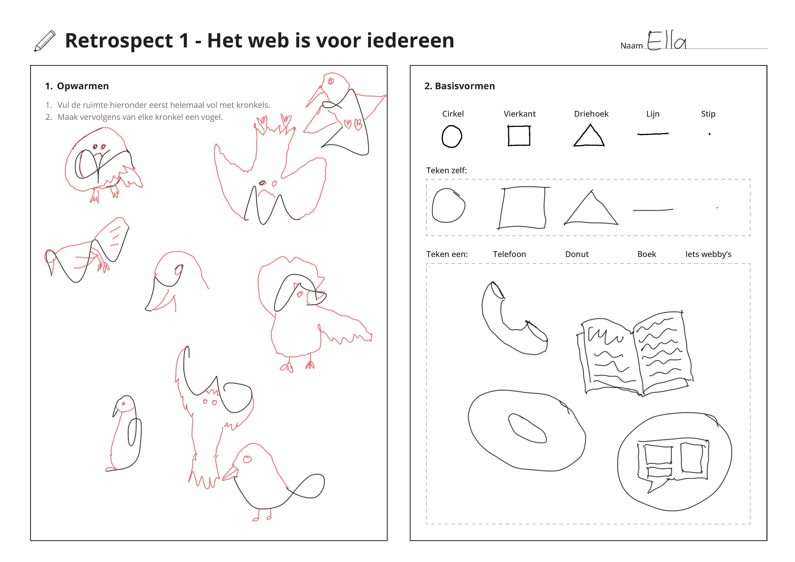
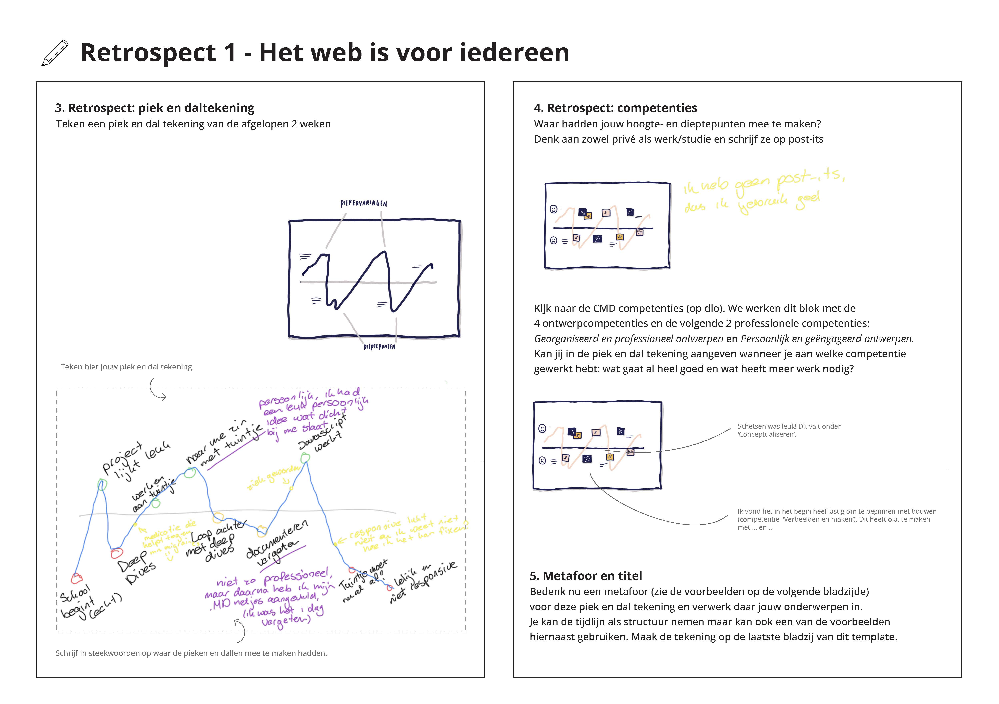
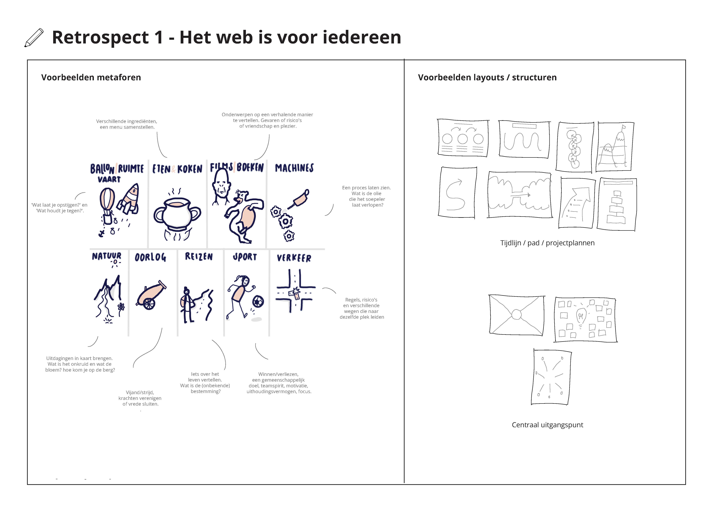
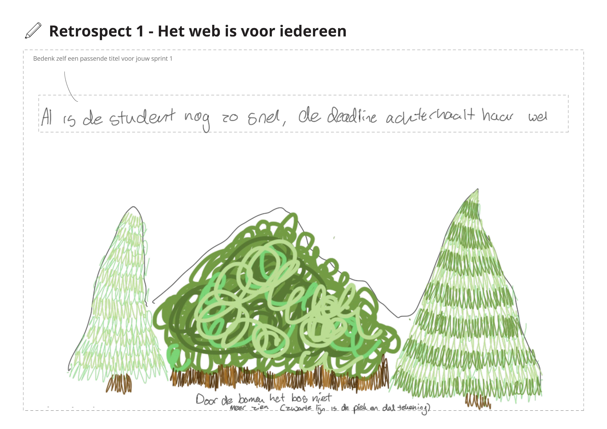

Het gesprek ging goed, ze waren erg te spreken en hebben goede tips en opmerkingen gegeven:

* bottomScherm moet in de header en topScherm is de main, ik heb het nu als div's in de body.
* Layout moet veranderen voor mobiel op beide schermen (scrollbaar maken op bovenste scherm op mobiel, kan met knoppen?)
* Annotaties in schetsen zetten
* GoodNotes en Concept voor schetsen op iPad

### Check out

#### Vragen en termen

* Waarom geven de docenten deze opdracht? <br>
  Omdat we deze dingen moeten leren, we moeten ook binnenkort een route kiezen dus daar moeten we ook op voorbereid zijn. Het is ook een hele vrije opdracht dus het geeft ook de kans om het persoonlijk en uniek te maken. Ik denk dat een grote reden van de opdracht is om te zien wat je doet met vrijheid aan keuze (met regels), in andere blokken word altijd gezegd wat je moet maken wat creativiteit kan tegenhouden.
* Welke technieken gebruik ik? <br>
  HTML, CSS en JavaScript. Vooral HTML en CSS zijn belangrijk (en voor mij nieuwer). Bij mijn vorige opleiding (1 jaar HBO-ICT) heb ik al veel met TypeScript gewerkt dus JavaScript gaat me redelijk goed af. CSS is helemaal nieuw voor me, natuurlijk weet ik de absolute basics maar meer dan dat mochten we niet doen, dat werd door de opleiding gezien als niet belangrijk.
* Wat zijn de randvoorwaarden?
  De website moet optijd en werkend op GitHub staan<br>
  Je bent aanwezig bij de voortgangsgesprekken <br>
  Je Learning log is bijgehouden en duidelijk <br>
  Je hebt je code zelf geschreven en de ideeën zelf bedacht <br>
  Je werk is netjes, wat betreft structuur en taal <br>
* Waar gebruik je HTML/CSS voor?
  HTML zijn de elementen, in HTML zeg je wat iets is, waar een link in zit en waar die je naartoe stuurt. In HTML link je ook de CSS en de JS (in het geval van dit project). CSS is hoe de elementen eruit zien, waar ze staan op de site, wat er gebeurd als je met je muis of tab op een element ziet.
* Wat kan er allemaal met CSS? <br>
  Ligt aan hoe goed je bent in CSS, je kan alles uit je andere bestanden (vooral HTML) mooi maken, laten bewegen. Voor dit blok kan je met CSS vooral opmaak doen, light en dark mode maken, werken met display: grid;.
* Verbeelden en conceptualiseren<br>
  Ik heb schetsen gemaakt van hoe ik ongeveer wil dat mijn site eruit gaat zien (achteraf op desktop, ik bedoelde het ook voor mobiel maar in de retrospective werd gezegd dat het anders moet op mobiel). <br>
  [Schets](#11-sep---School-en-deep-dive) <br>
  Dit is mijn schets, het is gebasseerd op de 3DS omdat dit mijn favoriete console is. Ik heb een paar kleine aanpassingen gemaakt omdat de huidige balk niet handig is voor de website en de eisen die eraan gesteld zijn door school. Misschien wil ik dit later veranderen maar voor nu is de verouderde balk beter passend.

#### Vragen en termen

* Lukt het om verschillende ideeën te bedenken? <br>
  Ja, ik had voordat ik definitief voor de 3DS ging meer ideeën, ik had ook als idee een flipphone, een pikmin thema, lieveheerstbeesjes en McBling. Ik ben meestal heel goed in ideeën bedenken maar vind het moeilijk om ze precies zo te maken als ik in mn hoofd heb.
* Lukt het om je ideeën te schetsen? <br>
  Ja, al ben ik heel slecht in tekenen. Ik kan de ideeën tekenen op een manier dat ik begrijp wat ik ermee bedoel, maar ik ben bang dat andere mensen moeite zullen hebben als ze alleen de schetsen zijn omdat ze erg abstract zijn. In de tekeningen ziet niet veel detail terwijl ik dat wel in mijn hoofd heb. Ik ben bezig met beter leren tekenen zodat ik mijn ideeën ook aan anderen kan overdragen
* Wat doet deze CSS-property? <br>
  Ik snap niet helemaal wat mijn antwoord hierop moet zijn, het is meer een statement dan een vraag. Maar ik probeer wel veel variablen, al heb ik niet echt de tijd om ermee te spelen door de druk die er staat om in zo'n korte tijd zo'n uitgebreide site neer te zetten. Wel zoek ik veel op als iets specifieks niet lukt en kijk ik op StackOverflow, hier hebben veel mensen vaak creative oplossingen om leuke dingen mee te maken. Ook als ik niet zeker weet wat ik wil ga ik kijken op W3-schools naar welke CSS-properties ik niet herken en leuk lijken om toe te voegen. Ik vind dit een hele handige manier van nieuwe dingen toevoegen omdar W3-schools erbij heeft staan hoe het werkt en ik tijdens het toevoegen kan kijken waar ik het effect voor kan gebruiken.
* Welke content, en welke HTML heb ik nodig? <br>
  Dit gaat me redelijk goed af omdat ik 3/4 jaar HBO-ICT heb gedaan, dat jaar was vooral HTML, TypeScript en databases linken. Hierdoor weet ik redelijk veel over deze dingen. Het enige wat ik nog moeilijk vind is werken zonder div en id, wij moesten juist veel daarmee werken. Ook vind ik het moeilijk wat ik moet doen bij een uitgebreide CSS, mijn navbar is bijvoorbeeld onder mijn main, ik wist niet dat deze dan alsnog in de header moest (al is het het onderste scherm) en het bovenste scherm de main is (al staat de header meestal boven de main).
* Hoe kan ik dit soort content vormgeven? <br>
  Met de CSS. Met grid, background-color, SVG en img, color, variabelen, z-index, position, etc. Er zijn heel veel dingen in CSS waarmee je kan vormgeven
* Wat als ik hier nu eens 1000 invul? <br>
  Waar?

#### Vragen en termen

* Begrijpen bezoekers de site? <br>
  Dat weet ik niet helemaal zeker, ik heb geen uitleg over hoe de site werkt. Ik denk dat de site redelijk te begrijpen is, alleen op het moment is de home knop nog vaag. Later wil ik dat de site helemaal bestuurbaar is met de knoppen van de ds en dan gaat de home knop ook beter te begrijpen zijn. Als je veel op een DS speelt/hebt gespeeld denk ik wel dat je de site gaat begrijpen. Als je dat niet doet denk ik dat je verder ook geen belang gaat hebben bij de site, al is ie natuurlijk heel mooi en wil je altijd kijken en ga je direct je DS reviven :p
* Wat vindt de opdrachtgever er van? <br>
  Goed hoop ik, de opdrachtgever (school) wou een persoonlijke, creative website. Al weet ik niet hoe creatief ik de site kan noemen omdat het sterk gebasseerd is op een al bestaand product. Desalniettemin ben ik er gerust op dat de opdrahtgever het goed vind.
* Werkt dit wel? <br>
  Ja, het werkt, maar waarschijnlijk niet tot het extent dat ik zou willen. Ik wil de hele site meer in de stijl maken van een 3DS, ook de graphics, maar dat is waarschijnlijk voor nu te moeilijk. De DS graphics zijn erg primitief vergeleken moderne apparaten zoals mijn laptop en mobiel. Ik hou heel erg van die oudere sfeer (ik voel me heel oud terwijl ik dit typ) en wil dat deel heel erg overbrengen, ik ben alleen bang dat ik dat echt moet maken, ik moet het tekenen en filteren zodat het eruit ziet alsof je het bekijkt op een DS, dat gaat heel moeilijk worden. Ook wil ik dat het 3D schijfje aan de zijkant het scherm echt 3D eruit laat zien, ook dat is nu nog buiten mijn kunsten.
* Oooooh, kan dit óók?! <br>
  Ik snap de vraag weer niet, dit is ook een statement? Ik had dit veel bij het retrospective gesprek, over de structuur van de HTML, dat je daadwerkelijk 3D kan maken in websites en dat je een SVG in de CSS kan zetten ipv elke HTML.
* Evalueren <br>
  Ik ben daar constant mee bezig, ik ben bij schoolopdrachten vaak (terecht) bang dat ik de opdracht een beetje kwijt ben en vooral iets aan het maken ben wat ik gewoon leuk vind. Ik ben iets te bewust soms, hierdoor ben ik nooit tevreden met mijn werk. Ik zie alle fouten, alles wat niet 100% de opdracht was, alles wat ik anders moest doen, of anderen het begrijpen, etc. Het nadeel is alleen dat ik fout denk, mensen begrijpen vaak de dingen waar ik me zorgen over maak, maar bij de dingen waar ik niet over nadacht omdat ik dacht dat het goed was hebben ze problemen met het begrijpen. Zo ben ik heel erg aan het stressen voor dingen die niet uit blijken te maak, maar ik een enorme omweg of iets compleet anders terwijl ik eigenslijk op de basics moet focussen (werkende batterij terwijl het niet responsive is).

#### Reflecteren met the riddle:

Een goede manier om bewuster te reflecteren is door je telkens deze vier vragen te stellen: (1) wat wilde ik weten? (2) wat deed ik om er achter te komen? (3) wat was het resultaat? (4) wat weet ik nu (niet)?

* Wat wil(de) ik weten/bereiken? <br>
  Een werkende 3DS met mijn favoriete 3DS spellen en muziek, er zijn in totaal 6/7 pagina's (ligt aan of ik de log een pagina maak of dat ik het naar mijn github stuur, ik zag dat ik github kan downloaden op mijn DS dus ik zou dat na kunnen bouwen als ik tijd overheb) met een index, een pagina voor de spellen, een pagina voor de muziek, een pagina met mijn favoriete recepten (cooking mama stijl) en een contact pagina.
* Wat heb ik gedaan? <br>
  Vooral heel veel code getypt, ik zou de volgende sprint nog wat kunnen focussen op meer schetsen, omdat ik het zo moeilijk vind om mijn ideeën op papier te zetten helpt schetsen niet echt voor me, ik heb alles in mijn hoofd. Maar als ik het niet oefen word ik nooit goed in schetsen.
* Wat was het resultaat? <br>
    Een 3DS met 2 schermen, het bovenste scherm laat de informatie zien terwijl het onderste scherm de verschillende pagina's laat zien. 4 spelletjes, 4 albums (beide wil ik er meer van maar ik weet nog niet hoe) en een draaiende CD, een lege recepten pagina, een contact form die geen database heeft of mail waar het naartoe gestuurd word.
* Wat weet je nu (niet)? <br>
    Ik heb nu een begin van de site en een beetje de indeling, sommige dingen werken, anderen miet. Ik heb het nog niet responsive kunnen krijgen en ik mis nog veel plaatjes (bij spellen en muziek vooral). Het receptendeel ben ik nog niet aan begonnen, de contactpagina is nog niet mooi of funcitioneel. De home knop op de DS stuurt je naar de index pagina. De datum en tijd kloppen met de huidige datum en tijd en de batterij laat het huidige batterijlevel zien van het apparaat waarop je de site bekijkt. De batterij laat opladen nog niet zien en de dag van de week staat er nog niet.
* Wat vond je (niet) leuk? <br>
    Het responsive maken, ik ben hier heel lang mee bezig geweest en heb alleen de navbar responsive gekregen en de about-pagina. Beide bleken alleen niet goed te zijn in het gesprek. De andere pagina's waren me helemaal niet gelukt. Dit was het minst leuke omdat het steeds iets nieuws proberen was en hoop te hebben dat dit werkte, om vervolgens de site te checken en te zien dat het nogsteeds niet gelukt was.
* Voldoet het nog aan de eisen? <br>
    Deels, het voldoet aan de eisen maar ik heb wel div's gebruikt omdat ik dacht dat deze nodig waren, dat bleken ze niet dus dat moet ik aanpassen. Ook heb ik id's omdat ik anders niet weet hoe ik specifieke dingen aan moet roepen. Verder voldoet het zeker aan de eisen, ik heb een light en dark mode, ik heb met grid gewerkt, ik heb met variabelen gewerkt, ik heb alleen HTML, CSS en JavaScript gebruikt in de site en de site is persoonlijk en uniek.

#### HTML validatie

* Is de HTML die je hebt geschreven nog wel valide? Check het regelmatig, hiermee voorkom je onverklaarbare fouten. En klopt de HTML wel? Gebruik je de juiste elementen op de juiste plek? <br>
    Ik heb zware (bijna) dagelijkse migraines dus ik gebruik vaak dingen zoals screenreaders, de site is niet optimaal maar het is bruikbaar, ik wil hier nog veel aan doen om het te optimaliseren, dit vind ik namelijk erg belangrijk.
* Check regelmatig of je website nog wel goed te gebruiken is met het toetsenbord. En of hij nog te begrijpen is met een screenreader. Zitten er alt-teksten op de afbeeldingen? Is het contrast overal hoog genoeg? <br>
    Ja, sowieso gebruik ik vaak een screenreader om dingen te testen als ik migraine heb, ik heb nog geen alt-tekst omdat ik nog niet veel plaatjes heb, later wil ik wel dat er een verborgen element zit die je alleen met een screenreader echt merkt die het uiterlijk van elke pagina verteld. 
    Contrast heb ik nog niet heel veel mee gewerkt, op een paar dingen (zoals de optie bar in het onderste scherm) hebben weinig contrast maar dat is een makkelijke fix, verder denk ik dat er redelijk goed contrast is.
* Is mijn website nog wel adaptief? <br>
    Ik heb een uitgebreide light en dark mode op alle pagina's, er is nog geen prefers-reduced-motion instelling maar tot zo ver denk ik dat alleen de draaiende CD een probleem is en dat is ook makkelijk te fixen als ik weet hoe. Het werkt voor nu alleen nog op laptop scherm maar daar moet ik nog aan werken, de DS is een heel moeilijk idee om responsive te maken
* Voldoet mijn website nog wel aan de wet? <br>
    Ik ken de wet niet uit mijn hoofd en het is te lang om nu helemaal te checken, al helemaal omdat ik heel veel nog moet maken. Ik denk dat ik voor nu nog niet aan de wet voldoe, al doe ik veel aan toegankelijk, zijn de foto's van mij of free use net als de lettertypes, etc. De wet is erg lang en heeft waarschijnlijk veel specifieke dingen.
* Zie ik mezelf nog wel terug in wat ik doe?
    Absoluut, de site is heel ik. Heel rommelig maar wel vrolijk, over een 3DS. Ik denk dat veel mensen om me heen als ze aan mij denken ook aan mijn roze 3DS denken (en andersom), ik neem dat ding overal mee naartoe, ik speel bijna altijd spelletjes op mijn DS als ik ergens ben. De site gaat verder ook over mijn favoriete dingen, mijn favoriete spelletjes op de 3DS, mijn favoriete muziek en mijn favoriete recepten. Misschien is het iets te veel mezelf.


# Sprint 2

## 19 & 20 september - Thuiswerk


Uit het gesprek vrijdag was ik een belangrijk detail vergeten, het contact formulier stu


```

<form action="https://formsubmit.co/your@email.com" method="POST">
     <input type="text" name="name" required>
     <input type="email" name="email" required>
     <button type="submit">Send</button>
</form>
```

```
<form id="contactForm" action="https://formsubmit.co/ajax/ella.van.willigen@hva.nl" method="POST">
    <input type="hidden" name="_captcha" value="false">
    <input type="text" name="name" required>
    <input type="text" name="bericht" required>
    <button id="submit" type="submit">Stuur</button>
    <p id="contactStatus" role="status" aria-live="polite"></p>
</form>    
```
```
function koppelContactformulier() {
   const formulier = document.querySelector('#contactForm');
   if (!formulier) return;

   formulier.addEventListener('submit', async (event) => {
      event.preventDefault();

      const knop = formulier.querySelector('button[type="submit"]');
      const status = formulier.querySelector('#contactStatus');
      knop.disabled = true;
      status.textContent = 'Versturen...';

      try {
         const antwoord = await fetch(formulier.action, {
            method: 'POST',
            body: new FormData(formulier),
            headers: { Accept: 'application/json' }
         });

         if (!antwoord.ok) throw new Error('Versturen mislukt');

         formulier.reset();
         status.textContent = 'Bericht verstuurd.';
      } catch (error) {
         status.textContent = 'Versturen mislukt. Probeer het opnieuw.';
      } finally {
         knop.disabled = false;
      }
   });
}
```